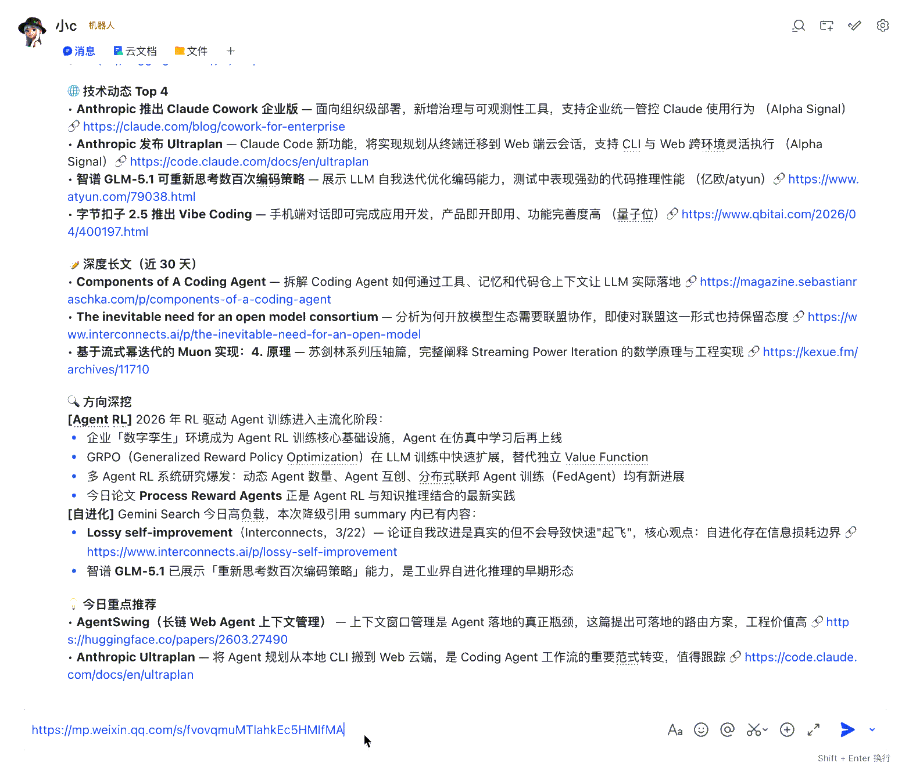

# Second Brain Skill

[中文](README.md) | **English**

> Plug your second brain into Claude Code. Inspired by [Karpathy's LLM Wiki](https://gist.github.com/karpathy/442a6bf555914893e9891c11519de94f), this project packages personal knowledge as a Skill, turning AI into an assistant that truly understands your context.

Traditional RAG is an **interpreter** — every query re-retrieves and reasons over raw documents from scratch. Second Brain Skill is a **compiler** — the LLM pre-compiles materials into a structured wiki, and knowledge **compounds over time**.

You curate materials and ask good questions; the LLM handles all the heavy lifting — summarization, cross-referencing, archiving, and consistency maintenance.

## Demo


## Three-Layer Architecture

| Layer | Location | Writer | Reader | Contents |
|:-----:|----------|:------:|:------:|----------|
| **Raw Materials** | `raw/` | You | LLM | Papers, articles, notes, PDFs, images |
| **Knowledge Base** | `wiki/` | LLM | You | Summaries, entities, concepts, analyses, cross-references |
| **Spec** | `Skill` | Co-evolve | LLM | SCHEMA, workflows, scripts |

## Quick Start

### 1. Install

```bash
# Clone the repo
git clone https://github.com/ChavesLiu/second-brain-skill.git

# Copy the skill to Claude Code's global directory
cp -r second-brain-skill/skills/wiki ~/.claude/skills/wiki

# Install dependencies
pip install -r ~/.claude/skills/wiki/scripts/requirements.txt
```

### 2. Initialize a Knowledge Base

```
/wiki init
```

Follow the prompts to choose a path, name, and language (zh/en) to create your knowledge base.

### 3. Ingest Your First Material

```bash
# Place materials in the raw/ directory
cp my-article.md ~/my-kb/raw/

# Ingest
/wiki ingest
```

The LLM automatically reads the material, creates summary pages, splits out entity and concept pages, and maintains cross-references. A single ingest may trigger the creation or update of 10–15 pages.

### 4. Query Your Knowledge

```
/wiki query What is Memex?
```

Or just use natural language:

```
Compare the pros and cons of RAG vs Wiki approaches
```

## Core Commands

| Command | Function |
|---------|----------|
| `/wiki init` | Create and register a new knowledge base |
| `/wiki ingest` | Ingest new materials (supports Markdown, PDF, images) |
| `/wiki query <question>` | Answer questions based on the knowledge base |
| `/wiki lint` | Knowledge base health check |
| `/wiki wipe` | Delete/reset (with recycle bin, recoverable) |
| `/wiki test` | Automated testing |

All commands also support **natural language** triggers — "ingest this article", "check the knowledge base", "summarize info about XX" — the LLM automatically identifies your intent.

## Natural Language Mode

You don't need to remember any commands. The Skill automatically detects your intent:

| What you say | Action taken |
|-------------|-------------|
| "Ingest this article" | ingest |
| "What is Memex?" | query |
| "Compare RAG and Wiki approaches" | query |
| "Always cite sources in answers" | Record preference to conventions.md |
| "Check the knowledge base" | lint |

This works especially well on the web (OpenClaw) — interact with your knowledge base like a chat.

## Obsidian Integration

Open the knowledge base directory with [Obsidian](https://obsidian.md/) to browse graph views, backlinks, and page content in real time. Recommended plugins:

- **Front Matter Title** — Display Chinese titles on graph nodes (pre-configured)
- **Dataview** — Metadata queries based on frontmatter
- **Web Clipper** — One-click browser clipping of web articles into raw/

## OpenClaw (Web)

After configuring the knowledge base path in OpenClaw's memory, you can achieve **zero-friction ingestion** — send a WeChat article link and the LLM automatically downloads, ingests, and organizes it, with no additional commands needed.



See [User Guide — OpenClaw Integration](docs/user-guide.en.md#openclaw-integration) for details.

## Knowledge Base Directory Structure

```
~/my-kb/                        # Knowledge base instance
├── raw/                        #   Raw materials (you write, LLM reads only)
│   ├── assets/                 #     Images and attachments
│   └── *.md / *.pdf            #     Material files
└── wiki/                       #   LLM-generated and maintained knowledge base
    ├── index.md                #     Content index
    ├── log.md                  #     Operation log
    ├── overview.md             #     Overview page
    ├── conventions.md          #     Usage conventions (your preferences)
    ├── sources/                #     Material summary pages
    ├── entities/               #     Entity pages (people, orgs, tools)
    ├── concepts/               #     Concept pages (theories, methods, patterns)
    └── analyses/               #     Analysis pages (comparisons, syntheses)
```

## Use Cases

- **Research** — Continuously read papers and progressively build a domain knowledge graph
- **Reading** — Ingest chapter by chapter; auto-build character, theme, and plot networks
- **Personal Growth** — Journals, articles, podcast notes; build a structured landscape of self-knowledge
- **Competitive Analysis** — Track competitors continuously with auto-maintained comparison tables
- **Team Knowledge Base** — Ingest meeting notes and project docs; LLM maintains automatically

## Documentation

- **[User Guide](docs/user-guide.en.md)** — Full installation, feature guide, Obsidian integration, OpenClaw setup
- **[Design Philosophy](skills/wiki/IDEA.md)** — Karpathy's original LLM Wiki vision
- **[Skill Technical Docs](skills/wiki/README.en.md)** — Page specs, workflow details, directory structure

## Acknowledgments

- [Andrej Karpathy](https://gist.github.com/karpathy/442a6bf555914893e9891c11519de94f) — Original LLM Wiki concept
- [Vannevar Bush](https://en.wikipedia.org/wiki/Vannevar_Bush) — Proposed the Memex concept in 1945, the intellectual origin of personal knowledge management

## License

MIT
